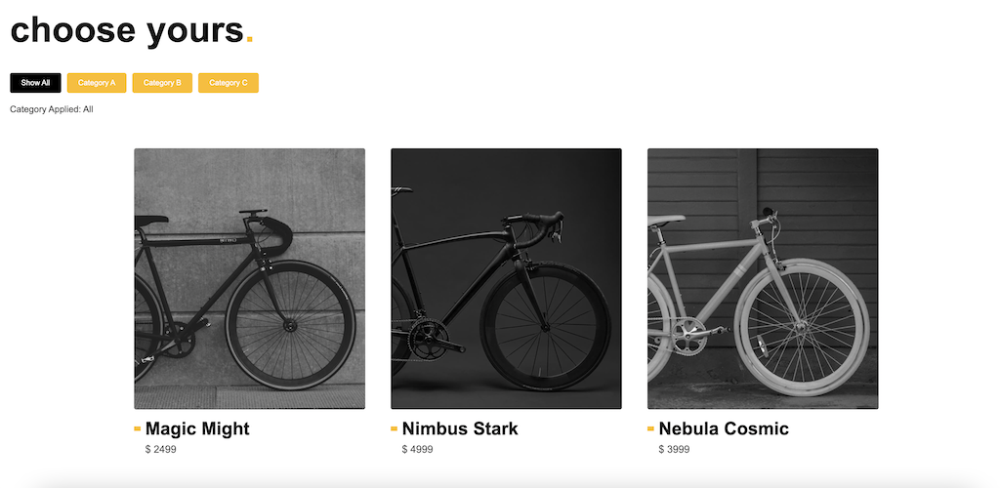
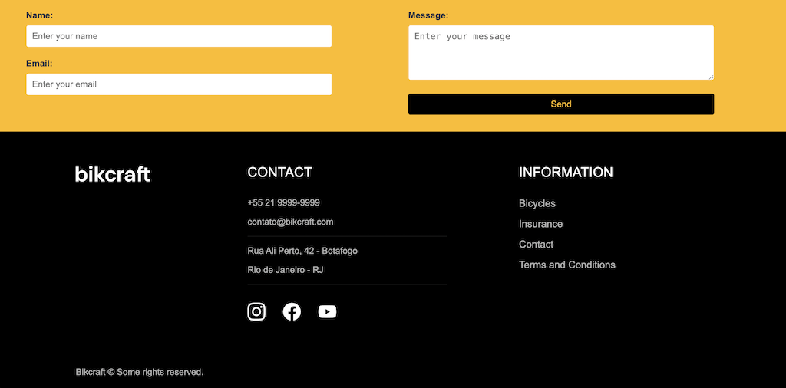

# My 1st Project with React + Vite

## Inspiration: 
<a href="https://www.origamid.com/projetos/bikcraft/">Bikcraft page from Origamid</a>

Following what I learned during my classes, I used Vite and React to create a project inspired by Bikcraft page from Origamid. It has the header, the footer and a simple list of bicycles. The changes include a simulation of a filter and a contact form using useState as a hook

### Technologies

- HTML
- CSS
- JavaScript
- React

---

### Sample

<h4 align="center">

</h4>